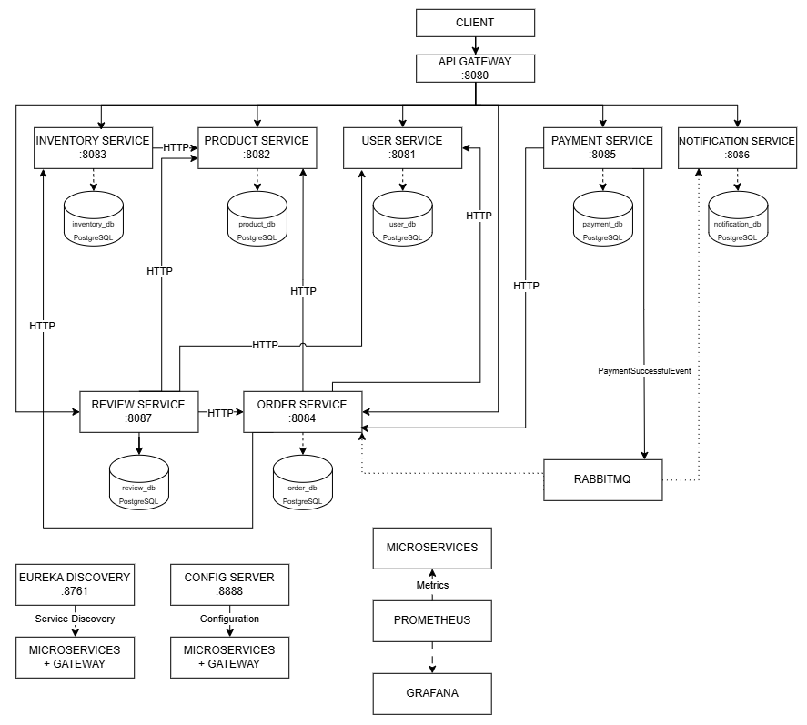

# Mikroservisni sistem e-trgovine

## Sadržaj

- [1. Opis projekta](#1-opis-projekta)
- [2. Poslovna logika sistema](#2-poslovna-logika-sistema)
- [3. Arhitektura sistema](#3-arhitektura-sistema)
- [4. Mikroservisi i njihove odgovornosti](#4-mikroservisi-i-njihove-odgovornosti)
  - [User Service](#user-service)
  - [Product Service](#product-service)
  - [Inventory Service](#inventory-service)
  - [Order Service](#order-service)
  - [Payment Service](#payment-service)
  - [Review Service](#review-service)
  - [Notification Service](#notification-service)
- [5. Spring Cloud komponente](#5-spring-cloud-komponente)
  - [API Gateway](#api-gateway)
  - [Discovery Server](#discovery-server)
  - [Config Server](#config-server)
- [6. Komunikacija između mikroservisa](#6-komunikacija-između-mikroservisa)
  - [Sinhrona komunikacija](#sinhrona-komunikacija)
  - [Asinhrona komunikacija](#asinhrona-komunikacija)
- [7. Bezbednost](#7-bezbednost)
  - [JWT autentifikacija i API Gateway](#jwt-autentifikacija-i-api-gateway)
  - [Autorizacija i korisničke uloge](#autorizacija-i-korisničke-uloge)
  - [Common Security](#common-security)
- [8. Tehnologije](#8-tehnologije)
- [9. Pokretanje aplikacije](#9-pokretanje-aplikacije)
  - [Docker Compose](#docker-compose)
  - [Kubernetes](#kubernetes)
- [10. Swagger / OpenAPI](#10-swagger--openapi)
- [11. CI/CD pipeline](#11-cicd-pipeline)
- [12. Testiranje](#12-testiranje)
  - [Unit testovi](#unit-testovi)
  - [Integracioni testovi](#integracioni-testovi)

## 1. Opis projekta

Ovaj projekat predstavlja mikroservisni sistem elektronske trgovine razvijen korišćenjem Spring Boot i Spring Cloud tehnologija. Sistem je organizovan kao skup nezavisnih mikroservisa zaduženih za upravljanje korisnicima, proizvodima, zalihama, porudžbinama, plaćanjima, recenzijama i notifikacijama. 

Komunikacija i koordinacija između servisa ostvarene su kombinacijom sinhrone i asinhrone komunikacije, uz primenu API Gateway-a, Service Discovery-ja i centralizovane konfiguracije. Svaki mikroservis je odgovoran za određenu poslovnu oblast i poseduje sopstvenu bazu podataka, čime se postiže razdvajanje odgovornosti i nezavisnost pojedinačnih komponenti sistema. Za skladištenje podataka koristi se PostgreSQL, dok je RabbitMQ zadužen za asinhronu razmenu poruka.

Autentifikacija i autorizacija zasnovane su na JWT tokenima. Sistem je kontejnerizovan pomoću Docker-a i implementiran u Kubernetes okruženju. Za praćenje rada sistema i prikupljanje metrika koriste se Prometheus i Grafana. Projekat takođe uključuje unit i integracione testove, kao i CI/CD pipeline za automatizovanu izgradnju, testiranje, kreiranje i objavljivanje Docker slika i deployment aplikacije u Kubernetes okruženje.

## 2. Poslovna logika sistema

Sistem omogućava upravljanje osnovnim procesima elektronske trgovine, od registracije i upravljanja korisnicima, preko upravljanja proizvodima i zalihama, do kreiranja porudžbina, obrade plaćanja, ostavljanja recenzija i slanja notifikacija.

Korisnici mogu da se registruju i prijave u sistem, pri čemu se razlikuju korisničke uloge sa različitim nivoima pristupa. Administratori imaju mogućnost upravljanja korisnicima i njihovim ulogama, proizvodima, zalihama, porudžbinama, plaćanjima i ostalim podacima u sistemu. Kupci mogu da pregledaju dostupne proizvode, kreiraju i pregledaju sopstvene porudžbine, izvrše plaćanje i otkažu porudžbinu.

Prilikom kreiranja porudžbine proverava se da li proizvodi postoje, da li su aktivni i da li je dostupna dovoljna količina na zalihama. Ukoliko su svi uslovi ispunjeni, potrebne količine proizvoda se rezervišu, a porudžbina se kreira u statusu `CREATED`.

Nakon uspešno izvršenog plaćanja, porudžbina prelazi u status `PAID`, dok se rezervisane količine trajno umanjuju sa zaliha. Informacija o uspešnom plaćanju se asinhrono prosleđuje putem RabbitMQ-a, na osnovu čega se kreira odgovarajuća notifikacija. Ukoliko kupac otkaže porudžbinu pre plaćanja, njen status se menja u `CANCELLED`, a rezervisane količine proizvoda ponovo postaju dostupne.

Sistem takođe omogućava kupcima da ostavljaju recenzije za proizvode koje su prethodno kupili. Prilikom kreiranja recenzije proverava se da li korisnik postoji, da li proizvod postoji, da li je korisnik prethodno kupio taj proizvod i da li je već ostavio recenziju za isti proizvod.

## 3. Arhitektura sistema

Sistem je organizovan prema mikroservisnoj arhitekturi i sastoji se od nezavisnih poslovnih mikroservisa, kao i zajedničkih infrastrukturnih komponenti. Svaki mikroservis je odgovoran za određenu poslovnu oblast i poseduje sopstvenu bazu podataka.

Klijentski zahtevi ulaze u sistem preko API Gateway-a, koji predstavlja centralnu ulaznu tačku i usmerava zahteve ka odgovarajućim mikroservisima. Discovery Server omogućava registraciju i pronalaženje servisa, dok Config Server obezbeđuje centralizovano upravljanje konfiguracijom.

Mikroservisi međusobno komuniciraju kombinacijom sinhronih HTTP zahteva i asinhrone razmene događaja putem RabbitMQ-a. Za skladištenje podataka koristi se PostgreSQL, dok se Prometheus i Grafana koriste za praćenje rada sistema i prikupljanje metrika.

<p align="center">
  
</p>

## 4. Mikroservisi i njihove odgovornosti

Sistem se sastoji od sedam poslovnih mikroservisa, od kojih je svaki zadužen za određenu oblast elektronske trgovine i poseduje sopstvenu bazu podataka. Mikroservisima se pristupa preko API Gateway-a, dok je njihova međusobna komunikacija ostvarena kombinacijom sinhronih i asinhronih mehanizama.

### User Service

User Service je zadužen za upravljanje korisnicima i autentifikaciju. Omogućava registraciju i prijavu korisnika, kao i kreiranje, pregled, izmenu i brisanje korisničkih naloga.

Prilikom registracije novi korisnik automatski dobija ulogu `CUSTOMER`, dok administratori mogu da kreiraju korisnike sa različitim ulogama i upravljaju njihovim podacima. Korisnik može da pregleda i menja sopstvene podatke, dok administratori imaju pristup podacima svih korisnika i mogu da upravljaju njihovim ulogama. Nakon uspešne prijave generiše se JWT token koji se koristi za autentifikaciju i autorizaciju prilikom pristupa ostalim servisima.

### Product Service

Product Service je zadužen za upravljanje podacima o proizvodima. Omogućava kreiranje, pregled, izmenu i brisanje (deaktiviranje) proizvoda.

Kupcima su dostupni samo aktivni proizvodi, dok administratori imaju pristup svim proizvodima i mogu da upravljaju njihovim podacima i statusom. Brisanje proizvoda realizovano je kao soft delete, pri čemu se proizvod ne uklanja fizički iz baze, već se označava kao neaktivan.

### Inventory Service

Inventory Service je zadužen za upravljanje zalihama proizvoda. Za svaki proizvod čuvaju se informacije o ukupnoj količini, rezervisanoj količini i trenutno dostupnoj količini.

Administratori mogu kreirati, pregledati, menjati i brisati podatke o zalihama. Prilikom kreiranja porudžbine, Order Service proverava dostupnost proizvoda i rezerviše potrebnu količinu. Rezervisana količina se ne smatra dostupnom za nove porudžbine. Nakon uspešnog plaćanja, rezervisana količina se trajno umanjuje sa zaliha. Ukoliko se porudžbina otkaže pre plaćanja, rezervisana količina se oslobađa i ponovo postaje dostupna.

### Order Service

Order Service je zadužen za kreiranje i upravljanje porudžbinama. Prilikom kreiranja porudžbine proverava se da li korisnik postoji, da li proizvodi postoje i da li su aktivni, kao i da li je dostupna dovoljna količina proizvoda na zalihama. Nakon uspešne provere, potrebne količine proizvoda se rezervišu, formiraju se stavke porudžbine i izračunava ukupna cena. Nova porudžbina se kreira u statusu `CREATED`.

Kupci mogu kreirati, pregledati i otkazati sopstvene porudžbine, dok administratori imaju pristup svim porudžbinama i mogu da upravljaju njima. Porudžbina se može otkazati samo dok se nalazi u statusu `CREATED`, pri čemu se prethodno rezervisane količine proizvoda oslobađaju.

Nakon uspešnog plaćanja, porudžbina prelazi u status `PAID`, a rezervisane količine proizvoda se trajno umanjuju sa zaliha. Servis takođe omogućava drugim mikroservisima proveru da li je određeni korisnik prethodno kupio određeni proizvod.

### Payment Service

Payment Service je zadužen za obradu i evidenciju plaćanja porudžbina. Plaćanje je moguće izvršiti samo za porudžbine koje se nalaze u statusu `CREATED`.

Pre kreiranja plaćanja proverava se da li korisnik ima pravo pristupa porudžbini i da li za nju već postoji evidentirano plaćanje. Nakon uspešne obrade kreira se evidencija o plaćanju sa jedinstvenim identifikatorom transakcije. Nakon uspešnog plaćanja, servis objavljuje događaj o uspešnom plaćanju putem RabbitMQ-a, koji mogu preuzeti mikroservisi zainteresovani za dalju obradu tog događaja. Notification Service na osnovu primljenog događaja kreira odgovarajuću notifikaciju.

Kupci mogu pristupiti samo sopstvenim plaćanjima, dok administratori imaju pristup svim evidentiranim plaćanjima. Sistem takođe podržava refundiranje uspešno izvršenih plaćanja.

### Review Service

Review Service omogućava korisnicima ostavljanje, pregled, izmenu i brisanje recenzija proizvoda.

Prilikom kreiranja recenzije proverava se da li korisnik postoji, da li proizvod postoji i da li je korisnik prethodno kupio taj proizvod. Takođe, korisnik može da ostavi samo jednu recenziju za isti proizvod. Korisnik može da menja i briše sopstvene recenzije, dok administratori imaju mogućnost brisanja bilo koje recenzije. Servis omogućava pregled recenzija prema proizvodu i korisniku.

### Notification Service

Notification Service je zadužen za kreiranje i čuvanje notifikacija nastalih tokom poslovnih procesa u sistemu.

Servis asinhrono prima događaje o uspešno izvršenim plaćanjima putem RabbitMQ-a. Na osnovu primljenog događaja kreira se notifikacija koja sadrži informacije o uspešnom plaćanju, porudžbini i identifikatoru transakcije. Pored kreiranja notifikacija, servis omogućava pregled pojedinačnih notifikacija, svih notifikacija i notifikacija povezanih sa određenom porudžbinom.

## 5. Spring Cloud komponente

Sistem koristi Spring Cloud komponente koje omogućavaju centralizovano upravljanje konfiguracijom, registraciju i pronalaženje mikroservisa, kao i usmeravanje zahteva ka odgovarajućim servisima.

### API Gateway

API Gateway predstavlja centralnu ulaznu tačku u sistem i dostupan je na portu `8080`. Zahtevi klijenata se prosleđuju kroz API Gateway, koji ih na osnovu definisanih ruta usmerava ka odgovarajućim mikroservisima.

Pored usmeravanja zahteva, API Gateway učestvuje u bezbednosti sistema tako što proverava JWT token i iz njega izdvaja informacije o autentifikovanom korisniku. Informacije o identifikatoru korisnika i njegovoj ulozi prosleđuju se odgovarajućim mikroservisima putem HTTP zaglavlja.

### Discovery Server

Discovery Server je dostupan na portu `8761` i omogućava registraciju i pronalaženje mikroservisa u sistemu. Svaki mikroservis se prilikom pokretanja registruje kod Discovery Server-a, nakon čega ostale komponente mogu koristiti naziv servisa umesto konkretne mrežne adrese i porta.

Na ovaj način se pojednostavljuje međusobna komunikacija mikroservisa i izbegava direktno oslanjanje na statički definisane adrese pojedinačnih servisa.

### Config Server

Config Server je dostupan na portu `8888` i omogućava centralizovano upravljanje konfiguracionim parametrima mikroservisa. Konfiguracije potrebne za rad pojedinačnih servisa učitavaju se preko centralnog konfiguracionog servera, čime se izbegava njihovo odvojeno održavanje u svakom mikroservisu.

Na taj način je upravljanje konfiguracijom pojednostavljeno i omogućena je centralizovana organizacija podešavanja sistema.

## 6. Komunikacija između mikroservisa

Komunikacija između mikroservisa realizovana je kombinacijom sinhrone i asinhrone komunikacije. Sinhrona komunikacija koristi se u slučajevima kada je za nastavak poslovnog procesa potrebno odmah dobiti odgovor od drugog servisa, dok se asinhrona komunikacija koristi za razmenu događaja koji ne zahtevaju neposredan odgovor.

### Sinhrona komunikacija

Za sinhronu komunikaciju između mikroservisa koriste se HTTP zahtevi. Servisi međusobno razmenjuju podatke kada je potrebno izvršiti proveru ili pribaviti informacije neophodne za nastavak određenog poslovnog procesa.

Na primer, prilikom kreiranja porudžbine, Order Service komunicira sa User Service-om kako bi proverio postojanje korisnika, sa Product Service-om radi provere proizvoda i njegovog statusa, kao i sa Inventory Service-om radi provere i rezervacije potrebne količine proizvoda.

Takođe, Review Service koristi sinhronu komunikaciju sa User Service-om, Product Service-om i Order Service-om kako bi proverio da li korisnik i proizvod postoje i da li je korisnik prethodno kupio proizvod za koji želi da ostavi recenziju.

Međusobna komunikacija servisa omogućena je korišćenjem Service Discovery-ja, tako da servisi mogu međusobno da se pronalaze bez potrebe za korišćenjem fiksno definisanih adresa.

### Asinhrona komunikacija

Za asinhronu komunikaciju koristi se RabbitMQ, koji omogućava razmenu poruka između mikroservisa putem događaja.

Nakon uspešno izvršenog plaćanja, Payment Service objavljuje događaj o uspešnom plaćanju. Taj događaj se putem RabbitMQ-a prosleđuje drugim servisima koji su zainteresovani za njegovu obradu.

Order Service na osnovu informacije o uspešnom plaćanju potvrđuje porudžbinu i ažurira njen status u `PAID`, pri čemu se prethodno rezervisane količine proizvoda trajno umanjuju sa zaliha. Notification Service prima isti događaj i na osnovu njega kreira odgovarajuću notifikaciju sa informacijama o porudžbini i izvršenoj transakciji.

Korišćenjem asinhrone komunikacije smanjuje se direktna zavisnost između servisa i omogućava nezavisna obrada događaja nastalih tokom poslovnih procesa.

## 7. Bezbednost

Bezbednost sistema zasnovana je na JWT autentifikaciji i kontroli pristupa zasnovanoj na korisničkim ulogama. API Gateway predstavlja centralnu ulaznu tačku za klijentske zahteve i zadužen je za proveru autentifikacije pre prosleđivanja zahteva odgovarajućim mikroservisima.

### JWT autentifikacija i API Gateway

Registracija i prijava korisnika realizovane su u okviru User Service-a. Nakon uspešne prijave generiše se JWT token koji sadrži informacije o identitetu korisnika, uključujući identifikator korisnika i njegovu ulogu.

Prilikom pristupa zaštićenim resursima, JWT token se šalje uz zahtev ka API Gateway-u. Gateway proverava njegovu validnost, a nakon uspešne autentifikacije iz tokena preuzima informacije o trenutno prijavljenom korisniku.

Informacije o identifikatoru korisnika i njegovoj ulozi zatim se prosleđuju odgovarajućim mikroservisima putem HTTP zaglavlja `X-User-Id` i `X-User-Role`. Na taj način mikroservisi ne moraju pojedinačno da obrađuju JWT token, već dobijene informacije koriste za sprovođenje autorizacije.

Rute za registraciju i prijavu korisnika dostupne su bez autentifikacije, dok je za pristup zaštićenim funkcionalnostima potrebno dostaviti važeći JWT token.

### Autorizacija i korisničke uloge

Sistem podržava dve korisničke uloge:

- `CUSTOMER` – korisnik sistema koji može da upravlja sopstvenim podacima, porudžbinama, plaćanjima i recenzijama.
- `ADMIN` – administrator koji ima proširena prava pristupa i mogućnost upravljanja korisnicima i njihovim ulogama, proizvodima, zalihama, porudžbinama, plaćanjima i drugim administrativnim podacima.

Pored provere korisničke uloge, kod određenih operacija proverava se i vlasništvo nad resursom. Na primer, korisnik može da pregleda ili menja samo sopstvene podatke, porudžbine, plaćanja i recenzije, dok administratori imaju pristup podacima svih korisnika i mogućnost upravljanja resursima u okviru sistema.

### Common Security

Zajednička funkcionalnost koja se odnosi na bezbednost izdvojena je u poseban `common-security` modul. Ovaj modul sadrži zajedničku logiku za generisanje i validaciju JWT tokena i koristi se u komponentama kojima je ta funkcionalnost potrebna, prvenstveno u User Service-u i API Gateway-u.

Izdvajanjem zajedničke bezbednosne logike u poseban modul izbegava se dupliranje koda i omogućava dosledna primena JWT autentifikacije u različitim delovima sistema.

## 8. Tehnologije

U projektu su korišene sledeće tehnologije i alati:

### Backend

- **Java 21** – programski jezik korišćen za razvoj mikroservisa.
- **Spring Boot** – razvoj REST API-ja i implementacija poslovne logike mikroservisa.
- **Spring Data JPA** – pristup i upravljanje podacima u bazama.
- **Spring Security** – podrška za bezbednosne funkcionalnosti sistema.
- **Spring Cloud** – implementacija distribuirane arhitekture kroz API Gateway, Service Discovery i centralizovanu konfiguraciju.
- **Maven** – upravljanje zavisnostima i izgradnja projekta.

### Baze podataka i razmena poruka

- **PostgreSQL** – skladištenje podataka mikroservisa.
- **RabbitMQ** – asinhrona komunikacija i razmena događaja između mikroservisa.

### Bezbednost

- **JWT** – autentifikacija korisnika i prenos informacija o identitetu i korisničkoj ulozi.

### Kontejnerizacija i orkestracija

- **Docker** – kontejnerizacija mikroservisa i pratećih komponenti.
- **Docker Compose** – lokalno pokretanje sistema u kontejnerima.
- **Kubernetes** – orkestracija i implementacija mikroservisa u Kubernetes okruženju.

### Praćenje sistema

- **Prometheus** – prikupljanje metrika o radu sistema.
- **Grafana** – vizuelizacija i praćenje prikupljenih metrika.

### Testiranje i automatizacija

- **JUnit 5** – implementacija unit i integracionih testova.
- **Mockito** – kreiranje mock objekata u unit testovima.
- **GitHub Actions** – automatizacija izgradnje, testiranja, objavljivanja Docker slika i deploymenta aplikacije u Kubernetes kroz CI/CD pipeline.

## 9. Pokretanje aplikacije

Aplikacija se može pokrenuti lokalno korišćenjem Docker Compose-a ili u Kubernetes okruženju. Za oba načina pokretanja obezbeđene su konfiguracije koje uključuju mikroservise i potrebne infrastrukturne komponente.

### Docker Compose

Za lokalno pokretanje sistema koristi se Docker Compose konfiguracija. Pre pokretanja aplikacije potrebno je kreirati .env fajl na osnovu fajla .env.example, koji se nalazi u direktorijumu deployment/docker, i definisati potrebne promenljive okruženja. One uključuju podatke za PostgreSQL, RabbitMQ, JWT konfiguraciju i Grafana SMTP podešavanja.

Kompletan sistem se pokreće komandom:

```bash
docker compose up --build
```

Na ovaj način se pokreću PostgreSQL, RabbitMQ, Spring Cloud komponente, svi mikroservisi, kao i Prometheus i Grafana za praćenje rada sistema. API Gateway predstavlja glavnu ulaznu tačku za pristup aplikaciji i dostupan je na portu `8080`.

### Kubernetes

Kubernetes konfiguracija nalazi se u direktorijumu:

```text
deployment/kubernetes
```

Aplikacija se pokreće unutar posebnog Kubernetes namespace-a `ecommerce`. Pre primene Kubernetes konfiguracije potrebno je podesiti poverljive podatke koji se koriste u sistemu. Primer konfiguracije nalazi se u fajlu:

```text
deployment/kubernetes/infrastructure/secret.example.yml
```

Stvarni secret.yml sadrži poverljive vrednosti i nije deo Git repozitorijuma. Za automatski deployment putem CI/CD pipeline-a, Kubernetes Secret se kreira na osnovu GitHub Secrets. Status pokrenutih komponenti može se proveriti komandama:

```bash
kubectl get pods -n ecommerce
kubectl get deployments -n ecommerce
```

## 10. Swagger / OpenAPI

Za dokumentovanje i testiranje REST API-ja koristi se OpenAPI specifikacija i Swagger UI.

Prilikom pokretanja aplikacije pomoću Docker Compose-a, Swagger UI je dostupan za pojedinačne mikroservise preko njihovih lokalnih portova:

- User Service – `http://localhost:8081/swagger-ui/index.html`
- Product Service – `http://localhost:8082/swagger-ui/index.html`
- Inventory Service – `http://localhost:8083/swagger-ui/index.html`
- Order Service – `http://localhost:8084/swagger-ui/index.html`
- Payment Service – `http://localhost:8085/swagger-ui/index.html`
- Notification Service – `http://localhost:8086/swagger-ui/index.html`
- Review Service – `http://localhost:8087/swagger-ui/index.html`

U Kubernetes okruženju, Swagger UI se može pregledati korišćenjem `kubectl port-forward` komande za odgovarajući mikroservis.

## 11. CI/CD pipeline

CI/CD pipeline je implementiran korišćenjem GitHub Actions-a i pokreće se prilikom push i pull request događaja prema main grani.

Pipeline je organizovan u nekoliko faza. Prvo se izvršavaju build i testovi za common-security modul. Nakon toga se korišćenjem matrix strategije paralelno pokreću build i testovi za sve mikroservise i Spring Cloud komponente. Servisi koji koriste common-security prethodno instaliraju ovaj modul u lokalni Maven repozitorijum.

Prilikom pull request događaja pipeline se završava nakon uspešnog build-a i testiranja. Docker slike se ne kreiraju niti objavljuju.

Prilikom push događaja na main granu, nakon uspešnog završetka svih testova, kreiraju se Docker slike za sve mikroservise i Spring Cloud komponente i objavljuju na Docker Hub.

Svaka Docker slika dobija tag latest, kao i dodatni tag koji sadrži SHA identifikator Git commita. SHA tag omogućava jednoznačno povezivanje Docker slike sa verzijom izvornog koda iz koje je slika izgrađena.

Nakon uspešnog objavljivanja Docker slika, pokreće se deployment faza na self-hosted GitHub Actions runneru. Runner ima pristup Kubernetes klasteru i izvršava Kubernetes komande pomoću `kubectl` alata.

U okviru deployment faze kreira se odnosno ažurira Kubernetes Secret na osnovu GitHub Secrets, nakon čega se primenjuju manifesti za infrastrukturne komponente, Spring Cloud komponente i poslovne mikroservise. Deployment koristi Docker slike označene SHA identifikatorom odgovarajućeg Git commita.

Na kraju se proverava uspešnost deploymenta korišćenjem `kubectl` rollout status komandi za sve aplikacione komponente, kao i proverom statusa svih podova u ecommerce namespace-u.

Na ovaj način pipeline obuhvata kompletan proces build-a, testiranja, kreiranja i objavljivanja Docker slika i automatskog deploymenta aplikacije u Kubernetes okruženje.

## 12. Testiranje

Testiranje aplikacije obuhvata unit i integracione testove. Testovi su implementirani korišćenjem JUnit 5 i Mockito biblioteka, dok se za testiranje komponenti koje zahtevaju stvarne instance infrastrukture koristi Testcontainers.

### Unit testovi

Unit testovi su implementirani za poslovnu logiku mikroservisa i pojedinačne komponente sistema. Prilikom testiranja servisnog sloja koriste se Mockito mock objekti za simulaciju zavisnosti, kao što su repozitorijumi i klijenti drugih mikroservisa.

Testovima su obuhvaćeni uspešni i neuspešni scenariji izvršavanja poslovne logike, uključujući proveru autorizacije korisnika, validaciju podataka, obradu grešaka i odgovarajuće izmene podataka. Testirane su i pojedinačne komponente zadužene za asinhronu komunikaciju.

### Integracioni testovi

Integracioni testovi proveravaju saradnju više komponenti unutar mikroservisa. Za testiranje REST API-ja koristi se `MockMvc`, kojim se simuliraju HTTP zahtevi i proveravaju odgovori aplikacije, HTTP status kodovi, autorizacija i podaci vraćeni kroz API.

Za testiranje rada sa bazom i eksternim komponentama koristi se Testcontainers, koji tokom izvršavanja testova pokreće stvarne instance potrebne infrastrukture, kao što su PostgreSQL i RabbitMQ.

Integracioni testovi obuhvataju kompletne poslovne tokove, od prijema HTTP zahteva do izvršavanja poslovne logike i upisa podataka u bazu. Pored toga, testirana je i asinhrona komunikacija putem RabbitMQ-a, pri čemu se proverava da li poslati događaji pravilno aktiviraju odgovarajuće listenere i dovode do očekivanih promena stanja sistema.


